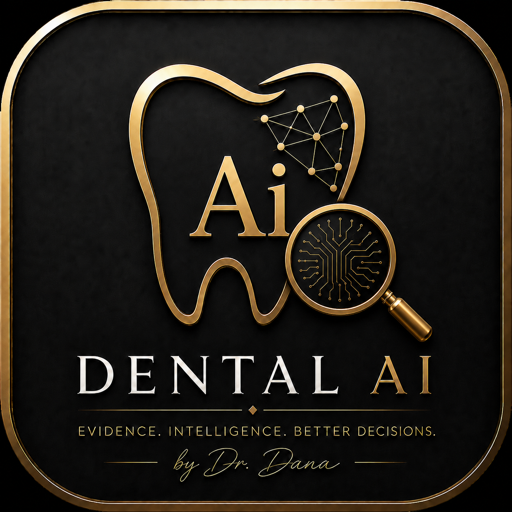

# Dental Research & Clinical Intelligence by Dr. Dana

<p align="center">
  
</p>

<p align="center">
  <b>Evidence. Intelligence. Better Decisions.</b><br>
  An evidence-grounded dental research and clinical decision-support plugin for Claude Code,
  with particular strength in esthetic and fixed prosthodontics.
</p>

<p align="center">
  <b>Version 1.0.2 &middot; Production Release</b><br>
  Plugin identifier <code>dana-dental-research</code> &middot; Designed by Dr. Dana Abu Rawaeh
</p>

---

## What it is

A structured clinical thinking partner. You describe a case; it organises what is known, marks what
is missing, runs a red-flag sweep, assigns prognosis, sequences treatment, and retrieves real
published evidence — showing its sources and its uncertainty at every step.

It is a decision-support tool. It does not diagnose, prescribe, or decide.

## Why it is different from generic Claude

Generic Claude will answer a clinical question from memory and sound confident. This plugin will
not.

- **It refuses to guess.** Every finding is tagged `[Reported]`, `[Observed]`, `[Inferred]` or
  `[Unknown]`. An inference must carry the reasoning behind it. An unknown stays unknown.
- **It searches real databases.** PubMed, Crossref and ClinicalTrials.gov are queried live. If it
  cannot verify a reference, it says so and gives you the search to run — it does not invent a
  citation.
- **It stops when it should.** Insufficient data, an unanswered red flag, or an undetermined
  prognosis will block a definitive treatment plan rather than produce a confident-looking one.
- **It protects sound tooth structure.** Full-coverage crowns require a real structural indication,
  never esthetic convenience.
- **It separates evidence from permission.** Strong research support does not make a product legal
  to use in Saudi Arabia; FDA and CE approval never substitute for Saudi status.

## The gated workflow

Every request runs through gates, and any gate can stop it:

```
Case / Question
   → Data Sufficiency
   → Red Flags
   → Prognosis
   → Treatment Sequencing
   → Evidence Retrieval
   → Citation Verification
   → Retraction Safety
   → Regulatory / Governance Check
   → Quality Control
   → Final Output
```

> **Evidence before confidence.**
> **Diagnosis before treatment.**
> **Biology before esthetics.**
> **Function before irreversible intervention.**
> **Preserve healthy tooth structure.**
> **Uncertainty must be visible.**

## Who it is for

Qualified dental professionals — consultants, specialists, general dentists — and supervised
residents and students. Clinical assistants and coordinators receive operational support only.

## Core capabilities

**Case analysis** — structured data ledger, missing-data ranking, problem list, differential
diagnosis, risk assessment, prognosis, phased treatment plan with alternatives.

**Treatment-plan auditing** — an adversarial review of a plan you already have: unstated
assumptions, sequencing errors, prognosis gaps, missed conservative options.

**Evidence research** — PICO framing, live retrieval, evidence classification, citation
verification, applicability to your patient, and an honest statement of what the evidence does not
answer.

**Prosthodontic decision support** — restorability assessment, veneer-versus-crown reasoning,
risk factors, treatment sequencing.

**Triage** — urgent symptoms, swelling, trauma, bleeding, with red-flag pre-emption.

**Research support** — question selection, novelty and feasibility assessment.

## The nine skills

| Skill | What it does |
|---|---|
| `start` | Orients you and routes your question to the right workflow |
| `clinical-governance` | Applies the safety, evidence, privacy and regulatory rules to any output |
| `clinical-case` | Analyses a case through the full governed diagnostic sequence |
| `triage` | Handles urgent symptoms — swelling, trauma, bleeding — before anything else |
| `esthetic-prosthodontics` | Governs elective esthetic and fixed-prosthodontic planning |
| `treatment-plan-audit` | Adversarially audits a treatment plan you already have |
| `scientific-problem-selection` | Helps choose, refine and de-risk a research question |
| `evidence-research` | Retrieves, verifies and appraises published evidence |
| `quality-control` | Checks a consequential output before you rely on it |

## Clinical safety architecture

The order is enforced, not suggested:

```
case data → sufficiency check → red-flag sweep → findings → prognosis → treatment planning
```

A safety block cannot be overridden by rephrasing or insisting. The only way past it is to resolve
the cause or refer to a human clinician.

- **Red-flag sweep** — 14 checks. A flag never answered is *not* a flag cleared.
- **Prognosis** — FAVORABLE / GUARDED / POOR / UNDETERMINED across five separate axes. No invented
  percentages. `UNDETERMINED` blocks irreversible planning.
- **Sequencing** — disease control before definitive prosthetics; a reversible mock-up before
  irreversible esthetic work; no restoration planned onto a tooth of undetermined prognosis.
- **Every plan** states alternatives including *no treatment* and *monitor/defer*, plus the
  expected service life, failure mode and exit strategy for anything irreversible.

## Evidence capabilities

Claims are graded, sourced, and checked for retraction. A registered clinical trial with no
published results is never treated as proof that a treatment works. A retracted paper is excluded,
not footnoted. A trial and the paper reporting it count as one study, not two.

## Live connectors

| Source | Status |
|---|---|
| PubMed / NCBI — literature | **Connected** |
| PubMed — systematic reviews & meta-analyses | **Connected** |
| Crossref — citation verification | **Connected** (metadata only, not full text) |
| ClinicalTrials.gov — trial registry | **Connected** |
| Clinical guidelines | Not connected |
| Manufacturer IFU | Not connected |
| SFDA — Saudi regulatory | **Not connected — authentication required** |

Connected means a real request from this code succeeded in a real environment — not that any given
search will succeed. **A failed search never means "no evidence exists."**

## Saudi governance layer

Every Saudi regulatory statement carries one of four states: **VERIFIED**, **REQUIRES
VERIFICATION**, **NOT APPLICABLE**, or **UNKNOWN / CONFLICT** — defaulting to *requires
verification*.

FDA approval, CE marking, manufacturer claims and clinical evidence **never** establish Saudi
status. Because SFDA authentication is not configured, Saudi product status cannot be confirmed
in-session and will always come back as *requires verification*. That is the correct answer, not a
failure.

Patient-data rules follow PDPL: minimise identifiers, de-identify before sharing, treat images as
personal data (including EXIF and identifiers burned into radiographs), and never let clinical
material flow into marketing without specific written publication consent.

## Installation

Two commands, once Claude Code is installed. No GitHub account needed.

```bash
claude plugin marketplace add danaaburawaeh-glitch/dental-research-clinical-intelligence
claude plugin install dana-dental-research@dana-dental
```

Verify it worked:

```bash
claude plugin list                          # shows v1.0.2, enabled
claude plugin details dana-dental-research  # lists all 9 skills
```

Then start Claude Code and try the orientation skill:

```bash
claude
```
```
/dana-dental-research:start
```

Full step-by-step instructions, written for a non-developer: **[INSTALLATION.md](INSTALLATION.md)**.

## Quick start

See **[QUICK_START_EN.md](docs/QUICK_START_EN.md)** or **[QUICK_START_AR.md](docs/QUICK_START_AR.md)**.

Start any session with:

```
/dana-dental-research:start
```

## Five useful first prompts

1. `/dana-dental-research:start` — see what the assistant can do and how to route your question.
2. *"I have a 45-year-old patient with a fractured upper first molar, previously root-treated.
   Help me assess restorability."*
3. *"Audit this treatment plan for a full upper arch of veneers on a patient with active gingival
   inflammation."*
4. *"What does the evidence say about the survival of no-prep versus conventional veneers?"*
5. *"Are there ongoing clinical trials on zirconia versus lithium disilicate posterior crowns?"*

## What information to provide for a clinical case

You do not need everything. Give what you have — the assistant will tell you what is missing and
which decision each gap would change.

```
Age:                          Radiographic findings:
Sex:                          Photographs:
Chief complaint:              Occlusion:
Medical history:              Periodontal status:
Medications:                  Habits / parafunction:
Allergies:                    Patient goals:
Dental history:               Proposed plan (if any):
Clinical examination:
```

## Privacy

**De-identify before you type.** Do not enter patient names, national ID or iqama numbers, medical
record numbers, phone numbers or addresses unless the clinical question genuinely requires them.

Radiographs and intraoral scans routinely carry hidden patient identifiers in their metadata, and
cropping a photograph does not remove them. Anything you enter is processed by an external AI
service — treat that as a data-transfer decision, not a formality. See
**[SECURITY.md](SECURITY.md)**.

## Limitations

- Not a replacement for licensed clinical judgment, and not a registered medical device.
- Clinical depth is strongest in **fixed prosthodontics and esthetic restorative dentistry**. Other
  specialties are not comprehensively covered and are referred out.
- It has no textbook knowledge base — it reasons about your case rather than reciting references.
- Prognosis reflects what you entered. It can detect a missing determinant, not a wrong one.
- Saudi regulatory status cannot currently be verified in-session.
- Shade and millimetre measurements cannot be taken from uncalibrated photographs.

Full list: [`plugin/dana-dental-research/docs/UNRESOLVED_GAPS.md`](plugin/dana-dental-research/docs/UNRESOLVED_GAPS.md)
and [CAPABILITIES_AND_LIMITATIONS_EN.md](docs/CAPABILITIES_AND_LIMITATIONS_EN.md).

## Regulatory disclaimer

This software is **not** a registered medical device and carries **no** SFDA, FDA or CE clearance.
Nothing in it constitutes regulatory authorisation for any product, material or procedure. See
**[DISCLAIMER.md](DISCLAIMER.md)** and **[TERMS_OF_USE.md](TERMS_OF_USE.md)**.

## Version and updates

Current version **1.0.2**. Update with:

```bash
claude plugin marketplace update dana-dental
claude plugin install dana-dental-research@dana-dental
```

Versioning policy: **[VERSIONING.md](VERSIONING.md)** · Changes: **[CHANGELOG.md](CHANGELOG.md)**

## Support

Report problems through the repository's issue tracker. For suspected privacy or security issues,
follow **[SECURITY.md](SECURITY.md)** instead of opening a public issue.

When reporting a clinical-behaviour problem, **never include patient-identifying information.**

## Documentation

| Document | For |
|---|---|
| [INSTALLATION.md](INSTALLATION.md) | Step-by-step installation, all levels |
| [QUICK_START.md](QUICK_START.md) · [EN](docs/QUICK_START_EN.md) · [AR](docs/QUICK_START_AR.md) | Getting started in five minutes |
| [User guide EN](docs/USER_GUIDE_EN.md) · [AR](docs/USER_GUIDE_AR.md) | How to work with it day to day |
| [Capabilities & limitations EN](docs/CAPABILITIES_AND_LIMITATIONS_EN.md) · [AR](docs/CAPABILITIES_AND_LIMITATIONS_AR.md) | Exactly what it does and does not do |
| [Release notes v1.0.2](docs/RELEASE_NOTES_v1.0.2.md) | What changed |
| [SECURITY.md](SECURITY.md) | Privacy and credential rules |
| [DISCLAIMER.md](DISCLAIMER.md) · [TERMS_OF_USE.md](TERMS_OF_USE.md) | Clinical and legal position |
| [VERSIONING.md](VERSIONING.md) · [CONTRIBUTING.md](CONTRIBUTING.md) | For maintainers |

## Release

**[v1.0.2 — Production Release](https://github.com/danaaburawaeh-glitch/dental-research-clinical-intelligence/releases/tag/v1.0.2)**
· 0 P0 blockers · 0 P1 blockers · 330 regression assertions passing.

Checksums are published with the release; verify a download with
`shasum -a 256 -c SHA256SUMS.txt`.

## Creator

Designed by Dr. Dana Abu Rawaeh

*The designer's name identifies this product and its creator. It is never a clinical, scientific,
regulatory or protocol authority for any claim the software makes — clinic-derived rules carry
`(OPS)` or `(JUDG)`, and scientific claims cite the real source.*
